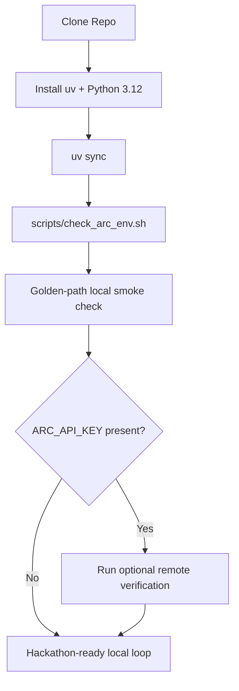

# Hackathon-Ready ARC Prize Environment Setup

## Overview

Turn this repo from an empty placeholder into a runnable ARC-AGI-3 starter environment for Ubuntu/Linux participants. The deliverable should let a teammate clone the repo, install the required toolchain, run a local-first starter agent without an API key, and optionally enable remote scorecards by adding an ARC Prize API key.

## Problem Frame

The user needs a practical environment for the ARC Prize hackathon, but the current repo does not contain any project scaffold, setup automation, or onboarding guidance beyond a one-line README. The upstream ARC Prize documentation is split across docs pages and GitHub repositories, and it leaves a few setup details implicit, including a meaningful split between local and online workflows, Python version expectations, and first-run verification. This plan creates a small, reproducible starter so participants can spend hackathon time on agent iteration instead of environment debugging.

## Requirements Trace

- R1. A clean Ubuntu/Linux user can bootstrap the repo into a working Python environment with clear, reproducible commands.
- R2. The first successful run must work in local mode without requiring `ARC_API_KEY`.
- R3. The repo must support optional remote mode through a documented `.env` contract and safe secret handling.
- R4. The repo must include a fast verification path that distinguishes required offline checks from optional online checks.
- R5. The starter must include one runnable ARC-AGI-3 entrypoint and lightweight tests that protect the setup contract.
- R6. The setup flow must be idempotent enough for hackathon re-runs after partial installs or stale virtual environments.
- R7. The repo must define one golden-path smoke check that proves a fresh clone can complete one real local ARC run.

## Scope Boundaries

- This work will not build a competitive ARC agent or benchmarking pipeline.
- This work will not guarantee Docker, WSL, or ARM64 support beyond noting them as best-effort.
- This work will not add CI, deployment, or PR automation unless the scaffold naturally needs a small smoke-check target.
- This work will not vendor datasets or implement full leaderboard submission orchestration.

## Context & Research

### Relevant Code and Patterns

- The repo currently contains only [README.md](/workspaces/RL-ARC-AGI-3/README.md) plus `.github` workflow assets, so this is effectively greenfield setup work.
- No existing Python project files, docs tree, test suite, or scripts were found in the working tree.

### Institutional Learnings

- No `docs/solutions/` learnings exist in this repo yet.

### External References

- ARC docs quickstart recommends `uv` or `pip`, local terminal rendering, and `arc-agi` as the Python SDK: `https://docs.arcprize.org/index.md`
- ARC docs explicitly recommend local mode for development and state that online mode requires an API key: `https://docs.arcprize.org/local-vs-online.md`
- ARC docs and starter repos use `ARC_API_KEY` for remote access, though one docs page includes inconsistent naming in prose: `https://docs.arcprize.org/api-keys.md`
- ARC toolkit docs expose a minimal starter and `env.reset()` / `env.step(...)` flow: `https://docs.arcprize.org/toolkit/minimal.md`
- Upstream `arc-agi` package metadata requires Python `>=3.12`, which is stricter than some broader benchmarking docs: `https://raw.githubusercontent.com/arcprize/arc-agi/main/pyproject.toml`
- Agents quickstart points to the public starter repo and `uv run main.py --agent=random --game=ls20`: `https://docs.arcprize.org/agents-quickstart.md`

## Key Technical Decisions

- Use a `uv`-managed project with two explicit Python contracts: `project.requires-python` will declare compatibility, while `.python-version` will pin the local interpreter used for the documented workflow.
- Make local mode the default runtime path: hackathon users should be able to validate the environment before they create or troubleshoot an API key.
- Separate configuration resolution from ARC runtime calls: the starter should be testable without requiring live ARC services or the real SDK during most unit tests.
- Treat live `arc-agi` package metadata as an implementation gate before locking dependencies: the scaffold should confirm the current upstream `requires_python` value before finalizing the pinned dependency.
- Provide a shell-based verifier for toolchain and environment checks, plus Python tests for configuration and CLI behavior: this keeps setup diagnosis fast while still protecting the starter contract.
- Keep secrets out of committed files by shipping `.env.example`, documenting shell-over-`.env` precedence, and ensuring verification output only reports redacted presence status.
- Prefer a small starter package over docs-only onboarding: a runnable scaffold is the fastest way to prove the environment works and stays usable.
- Use one golden-path smoke check as the controlling acceptance artifact: every file added by this plan should make that path pass rather than expanding the starter into a broader product surface.

## Open Questions

### Resolved During Planning

- Should the first-run flow require an API key: No. Local mode will be the default and the first success path.
- Which Linux targets are in scope: Native Ubuntu/Linux and the current dev container are the only explicit support targets.
- Should the project favor `pip` or `uv`: `uv` will be the primary path, with `pip` mentioned only as an upstream alternative in docs context.
- What counts as success for the initial implementation: a fresh clone can sync dependencies, run verification, and complete one documented local ARC task without an API key.

### Deferred to Implementation

- Exact pinned `arc-agi` version: defer until the dependency is added and locked in the scaffold after checking live upstream package metadata.
- Final CLI module naming and argument surface: defer until the starter package is implemented, as long as the README and tests converge on one documented command.
- Whether a tiny smoke-check task should live in a `Makefile` or stay in scripts/README only: defer based on what keeps the repo smallest.

## High-Level Technical Design

> *This illustrates the intended approach and is directional guidance for review, not implementation specification. The implementing agent should treat it as context, not code to reproduce.*

## Implementation Units

- [ ] **Unit 1: Create the Python scaffold and golden-path contract**

**Goal:** Establish a reproducible Python project, lock the supported toolchain, and define the exact local smoke check that the rest of the work must satisfy.

**Requirements:** R1, R5, R6, R7

**Dependencies:** None

**Files:**
- Create: `pyproject.toml`
- Create: `.python-version`
- Create: `.gitignore`
- Create: `src/rl_arc_agi_3/__init__.py`
- Create: `tests/test_config.py`
- Create: `tests/test_smoke.py`

**Approach:**
- Define a minimal `uv` project with an explicit compatibility range and a pinned local Python interpreter for Ubuntu/Linux.
- Confirm the live upstream `arc-agi` Python requirement before generating the lockfile.
- Use a `src/` layout so runtime code and tests remain cleanly separated.
- Define the golden path early: sync environment, run verifier, run one local ARC task, and treat that workflow as the acceptance target for later units.
- Ignore `.venv`, local env files, caches, and generated run artifacts to keep hackathon collaboration clean.

**Patterns to follow:**
- Keep the package layout conventional and lightweight because the repo has no stronger local pattern to inherit.

**Test scenarios:**
- The project metadata resolves under Python 3.12.
- The test suite can import package-local configuration helpers without requiring ARC network access.
- The smoke-check test describes the expected first-run path without requiring remote services.
- A second dependency sync does not require manual cleanup of committed files.

**Verification:**
- A fresh clone can create or sync a local virtual environment from project metadata without editing files by hand, and the repo has one documented local smoke-check target.

- [ ] **Unit 2: Add a local-first starter CLI and configuration layer**

**Goal:** Provide one thin documented command that can run locally without secrets and optionally switch to remote-capable behavior when configured.

**Requirements:** R2, R3, R5

**Dependencies:** Unit 1

**Files:**
- Create: `src/rl_arc_agi_3/config.py`
- Create: `src/rl_arc_agi_3/main.py`
- Create: `tests/test_cli.py`

**Approach:**
- Isolate environment resolution, mode selection, and CLI defaults in pure-Python helpers that can be tested without invoking the ARC service.
- Default the starter to a local game such as `ls20`, with optional arguments for game selection and explicit mode override.
- Keep remote behavior opt-in so a missing key yields guidance rather than a hard failure during local setup.
- Keep the entrypoint narrowly scoped to the golden path and avoid introducing profiles, plugin systems, or broader orchestration abstractions.

**Patterns to follow:**
- Mirror the upstream ARC docs flow of `reset`, `step`, and terminal rendering, while adapting it into a minimal package entrypoint.

**Test scenarios:**
- No `ARC_API_KEY` selects local mode and emits actionable guidance.
- A present key is detected without printing secret contents.
- Explicit mode flags override implicit environment defaults.
- Invalid or incomplete CLI arguments fail with clear usage text.

**Verification:**
- The documented starter command runs one real local session end-to-end without requiring secret configuration.

- [ ] **Unit 3: Add environment verification and secret-safe setup helpers**

**Goal:** Make setup failures diagnosable in under a minute and separate offline readiness from optional online readiness.

**Requirements:** R1, R3, R4, R6, R7

**Dependencies:** Units 1-2

**Files:**
- Create: `.env.example`
- Create: `scripts/check_arc_env.sh`
- Modify: `.gitignore`
- Test: `tests/test_cli.py`

**Approach:**
- Implement a shell verifier that checks required local prerequisites first: `uv`, pinned interpreter alignment, project sync status, import readiness, and starter command availability.
- Report remote checks separately so users without an API key still get a clean local-ready signal.
- Ensure `.env.example` documents only the minimum variables needed for hackathon participation.

**Patterns to follow:**
- Keep the script POSIX-friendly enough for Ubuntu shells and avoid shell features that complicate dev container usage.

**Test scenarios:**
- Missing `uv` produces remediation guidance.
- Wrong Python version is called out before the user hits runtime errors.
- Missing `ARC_API_KEY` is reported as optional for local mode.
- A valid local run remains the main success signal even when remote checks are skipped.
- Re-running verification after a successful sync produces the same ready state.

**Verification:**
- Users can tell the difference between “local setup is complete” and “remote API is configured” from one command, and the required checks do not depend on ARC service availability.

- [ ] **Unit 4: Write the hackathon onboarding and quickstart docs**

**Goal:** Compress the first-run path into a short README while keeping deeper troubleshooting and workflow notes accessible.

**Requirements:** R1, R2, R3, R4, R6, R7

**Dependencies:** Units 1-3

**Files:**
- Modify: `README.md`
- Create: `docs/setup/arc-hackathon-environment.md`

**Approach:**
- Make the README the fast path: prerequisites, sync, verify, run local starter, then optional API-key setup.
- Put troubleshooting, environment details, and upstream ARC references in the setup guide.
- Call out the docs split between local development, online scorecards, and benchmarking so users do not confuse the starter with the separate benchmarking harness.
- Document the golden path explicitly and keep every other workflow secondary to that local-first sequence.

**Patterns to follow:**
- Favor copy-pastable commands and short expectation-setting text over long narrative explanation.

**Test scenarios:**
- A new user can follow the README without consulting external docs for the first local run.
- The setup guide answers the most likely failures: missing `uv`, wrong Python, missing key, invalid key, and local-vs-online confusion.

**Verification:**
- The documented commands match the implemented files and produce the expected local-ready workflow on Ubuntu.

## System-Wide Impact

- **Interaction graph:** Shell environment and `.env` values flow into a small configuration layer, which then decides whether the CLI runs a local ARC environment only or attempts optional remote-capable behavior.
- **Error propagation:** Toolchain and configuration failures should stop before ARC gameplay starts, with actionable remediation text instead of opaque tracebacks where possible.
- **State lifecycle risks:** The main persistent state is local environment setup (`.venv`, lockfiles, env files, and any local run outputs). The scaffold should avoid creating hidden mutable state outside the repo except for normal package caches.
- **API surface parity:** The README command, verification script, and Python entrypoint must agree on the same primary workflow so docs and runtime do not drift.
- **Integration coverage:** At least one smoke-style run should exercise the actual starter command against a known local ARC task, because unit tests alone will not prove that the project metadata, dependency install, and CLI wiring all align.

## Risks & Dependencies

- **Required local dependencies:** `uv`, the pinned interpreter, the locked `arc-agi` dependency, and a local smoke-check task that does not require remote services.
- **Optional remote dependencies:** `ARC_API_KEY`, network reachability, and ARC Prize service availability for scorecards or remote-backed checks.
- The upstream docs are slightly inconsistent about Python requirements across toolkit versus benchmarking materials; this repo should explicitly pin to the toolkit-compatible version after verifying live package metadata.
- The ARC SDK or remote service may drift, so the local-first path must remain useful even if online checks are temporarily unavailable.
- Secret handling and status output must stay conservative so the verifier cannot leak API keys.
- Because the repo is greenfield, there is some naming flexibility; the main risk is overbuilding beyond what hackathon onboarding actually needs.

## Documentation / Operational Notes

- README should stay short and task-oriented.
- The longer setup guide should include links to upstream ARC docs for scorecards, tasks, and benchmarking, while clearly marking benchmarking as adjacent rather than required for first-run setup.
- No production monitoring is needed, but the final workflow should still state whether there is any additional operational monitoring required.

## Sources & References

- External docs: `https://docs.arcprize.org/index.md`
- External docs: `https://docs.arcprize.org/local-vs-online.md`
- External docs: `https://docs.arcprize.org/api-keys.md`
- External docs: `https://docs.arcprize.org/toolkit/minimal.md`
- External docs: `https://docs.arcprize.org/agents-quickstart.md`
- External docs: `https://raw.githubusercontent.com/arcprize/arc-agi/main/pyproject.toml`